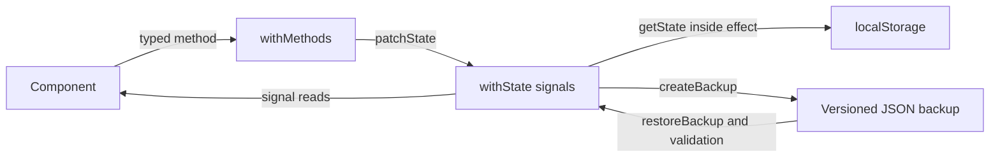

# NgRx Signals in Stillora

This guide explains how Stillora uses `@ngrx/signals`, how SignalStore differs from the classic
`@ngrx/store`, and how to design state updates, derived state, persistence side effects,
asynchronous work, and portable JSON backups.

The examples target Angular 22 and the `@ngrx/signals` version declared in this project.

## Installation

From WSL:

```bash
npm i @ngrx/signals@22.0.0-beta.0 --save-exact
```

`rxMethod` and the other RxJS interoperability APIs are included by this package and are imported
from `@ngrx/signals/rxjs-interop`; they do not require a second installation.

## The SignalStore mental model

A SignalStore is an injectable Angular service assembled from small features:

- `withState` defines writable state.
- `withComputed` defines values derived from that state.
- `withMethods` exposes allowed state transitions and commands.
- `withHooks` runs initialization and cleanup logic.
- `withProps` can expose injected dependencies or other non-state properties.
- `patchState` performs immutable state updates.
- `getState` returns a plain snapshot of the complete state.

Each top-level state property becomes a signal. Components read a property by calling it:

```ts
settings.theme();
settings.volume();
settings.mixLayers();
```

The component does not subscribe manually and does not need the `async` pipe. Angular tracks signal
reads and updates only consumers affected by a change.



## A minimal store

```ts
import { computed } from '@angular/core';
import { patchState, signalStore, withComputed, withMethods, withState } from '@ngrx/signals';

interface PlayerState {
  readonly playing: boolean;
  readonly volume: number;
}

const initialState: PlayerState = {
  playing: false,
  volume: 0.7,
};

export const PlayerStore = signalStore(
  { providedIn: 'root' },
  withState(initialState),
  withComputed(({ volume }) => ({
    volumePercent: computed(() => Math.round(volume() * 100)),
  })),
  withMethods((store) => ({
    toggle(): void {
      patchState(store, { playing: !store.playing() });
    },
    setVolume(volume: number): void {
      patchState(store, { volume: Math.min(1, Math.max(0, volume)) });
    },
  })),
);
```

State is protected by default. Code outside the store can read its signals and call its methods but
cannot patch the store directly. Keep this default so state changes remain easy to find and test.

## How Stillora structures state

Stillora keeps device preferences and the saved mixer configuration in one serializable
`AppSettings` object:

```ts
export interface AppSettings {
  readonly theme: 'light' | 'dark' | 'system';
  readonly fadeDuration: 5 | 10 | 15;
  readonly rememberSound: boolean;
  readonly defaultTimer: 5 | 10 | 15 | 20 | 30 | 45 | 60 | 'continuous';
  readonly volume: number;
  readonly lastSoundId: string;
  readonly lastBackground: string;
  readonly mixLayers: readonly MixLayer[];
  readonly savedMixes: readonly SavedMix[];
}
```

This state belongs in SignalStore because multiple routes need it, it must survive application
restarts, every change needs consistent validation, and the complete state maps to a portable JSON
backup.

Live `HTMLAudioElement` and `HTMLVideoElement` objects do **not** belong in the store. They are
imperative, non-serializable browser resources. Focused services own those objects while the store
keeps only their serializable configuration.

## Loading initial state

`withState` accepts a factory that runs in Angular's injection context. Stillora uses that factory
to read local storage when its singleton store is created:

```ts
export const SettingsStore = signalStore(
  { providedIn: 'root' },
  withState(() => readSettings(inject(DOCUMENT))),
  // Other features follow.
);
```

The reader treats parsed JSON as `unknown`, checks its shape, clamps numeric values, validates union
types, and falls back to safe defaults. Never cast untrusted JSON directly to `AppSettings`; a
TypeScript cast performs no runtime validation.

## Updating state

Expose intent-based methods and update state with `patchState`:

```ts
withMethods((store) => ({
  updateTheme(theme: ThemePreference): void {
    patchState(store, { theme });
  },
  updateMixLayers(mixLayers: readonly MixLayer[]): void {
    patchState(store, { mixLayers });
  },
}));
```

For an update calculated from existing state, use the callback form:

```ts
patchState(store, (state) => ({
  mixLayers: [...state.mixLayers, newLayer].slice(0, 3),
}));
```

Do not mutate arrays or objects obtained from a state signal. Create a new array or object:

```ts
patchState(store, (state) => ({
  mixLayers: state.mixLayers.filter((layer) => layer.soundId !== soundId),
}));
```

## Derived state

Use `withComputed` for values calculated from existing state:

```ts
withComputed(({ mixLayers, volume }) => ({
  mixCount: computed(() => mixLayers().length),
  muted: computed(() => volume() === 0),
}));
```

Do not store `mixCount` separately. Duplicated derived data can become inconsistent with its source.

Stillora keeps audio-engine-derived values in `AudioService` because they combine persisted
configuration with live playback state. Pure preference-derived values can move into
`SettingsStore.withComputed` when multiple consumers need them.

## Side effects and localStorage persistence

State methods should describe state transitions. Persistence is a reaction to every transition, so
Stillora handles it once in a lifecycle hook:

```ts
withHooks((store) => {
  const document = inject(DOCUMENT);

  return {
    onInit(): void {
      effect(() => {
        const state = getState(store);
        document.defaultView?.localStorage.setItem('stillora.settings', JSON.stringify(state));
      });
    },
  };
});
```

`getState(store)` returns a plain snapshot. Inside Angular's `effect`, its state reads are tracked,
so the effect runs again when state changes.

Angular effects are glitch-free: several synchronous patches in one turn can be coalesced and
persisted once with the final state. This is desirable for localStorage. Use `watchState` when every
intermediate transition must be observed synchronously, such as an undo history or audit trail:

```ts
withHooks({
  onInit(store): void {
    watchState(store, (state) => {
      history.push(structuredClone(state));
    });
  },
});
```

Choose one persistence owner. Do not write localStorage separately from each component or method.

### Side-effect rules

- Keep validation and state transitions inside the store.
- Keep browser and file transport in focused services.
- Use `effect` for reactions to signal state.
- Use `watchState` only when coalescing would lose required information.
- Never perform side effects in `withComputed`; computed values must stay pure.
- Catch storage failures because privacy-restricted contexts may deny storage.

## Asynchronous side effects

Small Promise-based commands can be regular store methods:

```ts
withMethods((store, api = inject(ProfileApi)) => ({
  async loadProfile(): Promise<void> {
    patchState(store, { loading: true, error: '' });
    try {
      const profile = await api.load();
      patchState(store, { profile, loading: false });
    } catch {
      patchState(store, { loading: false, error: 'Profile could not be loaded.' });
    }
  },
}));
```

For streams needing debouncing, cancellation, or flattening, use `rxMethod`:

```ts
readonly search = rxMethod<string>(
  pipe(
    debounceTime(250),
    distinctUntilChanged(),
    switchMap((query) => api.search(query)),
    tap((results) => patchState(store, { results })),
  ),
);
```

Use `switchMap` when a newer request should cancel an older one, `concatMap` when order matters, and
`exhaustMap` when a second request must be ignored until the first completes.

## JSON backup mapping

Stillora separates state mapping from file transport:

1. `SettingsStore.createBackup()` maps the current state snapshot—including up to five named saved
   mixes—to a versioned backup.
2. `BackupFileService` serializes and downloads it or passes it to Android's document picker.
3. `BackupFileService` parses imported JSON as `unknown`.
4. `SettingsStore.restoreBackup()` checks the app and schema, maps validated settings, and patches
   the store.
5. The persistence effect writes restored state to localStorage automatically.
6. Audio and video services apply the serializable configuration to live media elements.

The backup envelope is versioned:

```json
{
  "schemaVersion": 1,
  "app": "Stillora",
  "exportedAt": "2026-07-26T10:00:00.000Z",
  "settings": {
    "theme": "system",
    "fadeDuration": 5,
    "rememberSound": true,
    "defaultTimer": 15,
    "volume": 0.72,
    "lastSoundId": "gentle-rain",
    "lastBackground": "video/rain.mp4",
    "mixLayers": [],
    "savedMixes": []
  }
}
```

When the format changes, increment `schemaVersion` and add an explicit migration. Do not silently
interpret an incompatible future schema as the current format.

## Consuming a SignalStore

Inject the store and call its methods:

```ts
export class Settings {
  protected readonly settings = inject(SettingsStore);

  protected selectDarkTheme(): void {
    this.settings.updateTheme('dark');
  }
}
```

Read its signals directly in the template:

```html
<button type="button" [attr.aria-pressed]="settings.theme() === 'dark'" (click)="selectDarkTheme()">
  Dark
</button>
```

Avoid copying a store signal into a second component signal unless the component intentionally
maintains an editable draft.

## SignalStore versus classic NgRx Store

Both libraries provide typed, predictable state management, but their programming models and ideal
scope differ.

| Concern            | `@ngrx/signals` SignalStore                    | `@ngrx/store`                                      |
| ------------------ | ---------------------------------------------- | -------------------------------------------------- |
| Reactive primitive | Angular Signals                                | RxJS Observables                                   |
| Write model        | Typed methods calling `patchState`             | Dispatched actions handled by reducers             |
| Read model         | State and computed signals                     | Memoized selectors                                 |
| Side effects       | Methods, `effect`, `watchState`, or `rxMethod` | NgRx Effects listening to actions                  |
| Boilerplate        | Usually one store file and models              | Actions, reducer, selectors, effects, registration |
| Event history      | Method calls are not an event log by default   | Actions form an explicit event stream              |
| DevTools workflow  | State-oriented and extensible                  | Mature action/state time-travel workflow           |
| Best fit           | Local, feature, and cohesive shared state      | Large event-driven global workflows                |
| Template use       | Direct signal calls                            | Observable selection, often with `async`           |
| RxJS               | Optional interoperability                      | Fundamental to the store API                       |

### When SignalStore is the better fit

- State is naturally owned by one feature or cohesive service.
- Components benefit from direct Angular Signal consumption.
- Typed commands are clearer than a global action vocabulary.
- Less ceremony is wanted without losing protected, testable transitions.
- Side effects are local to the store's responsibility.

Stillora fits these conditions: preferences and backup state form one cohesive, serializable domain.

### When classic Store is the better fit

- Many unrelated features react to the same domain events.
- Action history and time-travel debugging are central.
- Reducer purity and event replay are architectural requirements.
- Complex effects coordinate large RxJS workflows across the application.
- The team already relies on action, reducer, selector, and effect conventions.

Classic Store is RxJS-powered global state management. Actions express events, reducers
synchronously calculate immutable transitions, selectors form the read model, and NgRx Effects
isolate impure work. SignalStore does not make that architecture obsolete; it provides a more
direct signal-oriented option where an application-wide event bus is unnecessary.

## Testing

Test store behavior through public methods and signal reads:

```ts
it('clamps volume', () => {
  TestBed.configureTestingModule({});
  const store = TestBed.inject(SettingsStore);

  store.updateVolume(2);

  expect(store.volume()).toBe(1);
});
```

For persistence tests:

- provide a controlled `DOCUMENT`;
- clear `stillora.settings` before each test;
- create the store through dependency injection so its hook runs;
- flush effects before asserting localStorage;
- verify malformed stored JSON falls back safely.

For backup tests, cover valid round trips, invalid JSON, the wrong app name, unsupported schemas,
invalid unions and volumes, duplicate layers, unavailable sounds, and excessive layers.

## Common mistakes

### Mutating state directly

Do not push into `store.mixLayers()`. Patch a new array inside a store method.

### Treating a cast as validation

`JSON.parse(text) as AppSettings` is unsafe. Parse as `unknown` and narrow external fields.

### Storing browser objects

DOM nodes, audio elements, subscriptions, and services are not serializable state. Store their IDs,
configuration, and statuses instead.

### Scattering persistence

If every method writes localStorage, a future method may forget. One tracked effect persists all
state transitions consistently.

### Using an effect for derived state

If a value is calculated only from state, use `withComputed`. Effects are for work outside the
reactive state graph.

### Choosing SignalStore only to avoid actions

For a genuinely event-driven system with many consumers, actions can be useful domain
documentation. Choose based on architecture, not line count alone.

## Project files

- `src/app/core/stores/settings.store.ts` — state, validation, methods, backup mapping, and
  persistence effect.
- `src/app/core/models/app.models.ts` — serializable state and backup contracts.
- `src/app/core/services/backup-file.service.ts` — browser and Android JSON transport.
- `src/app/core/services/theme.service.ts` — applies the stored theme to the DOM and Android bars.
- `src/app/core/services/audio.service.ts` — applies stored sound and mix configuration to live
  audio elements.
- `src/app/features/settings/settings.ts` — Settings UI integration.

## Official references

- [NgRx Signals overview](https://ngrx.io/guide/signals)
- [SignalStore guide](https://ngrx.io/guide/signals/signal-store)
- [SignalStore state tracking](https://ngrx.io/guide/signals/signal-store/state-tracking)
- [SignalStore lifecycle hooks](https://ngrx.io/guide/signals/signal-store/lifecycle-hooks)
- [Classic NgRx Store guide](https://ngrx.io/guide/store)
- [NgRx reducers](https://ngrx.io/guide/store/reducers)
- [NgRx selectors](https://ngrx.io/guide/store/selectors)
- [NgRx Effects](https://ngrx.io/guide/effects)
